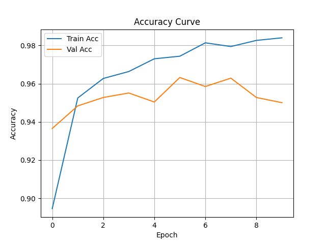
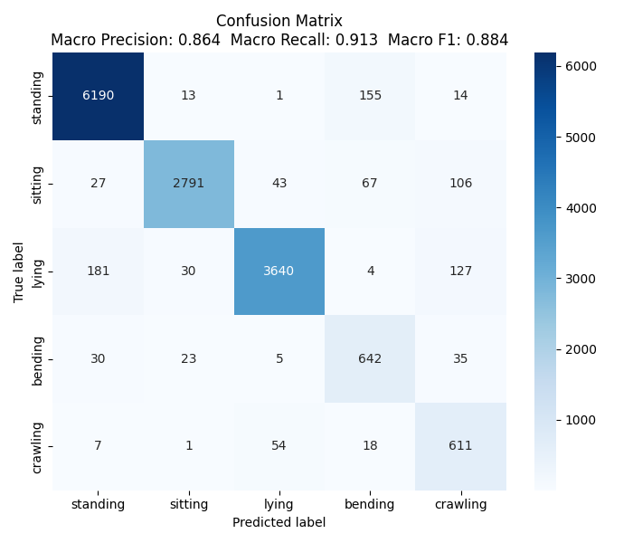

# DST-FallNet

## Project Overview
This project is a real-time multimodal fall detection system that integrates visual (MoveNet, CNN) and audio (LSTM) models, utilizing Dempster-Shafer Theory (DST) for decision-level fusion. The system is designed to run on resource-constrained embedded devices such as Jetson Nano 2GB, supports GPIO output, and is suitable for long-term automated monitoring.

Project website: [https://www.mkchou.online/](https://www.mkchou.online/)

## Hardware Used
- Jetson Nano 2GB
- USB Camera
- USB Microphone
- LED, Buzzer (GPIO output, BOARD pin 38)
- Push button to clear the alert (GPIO input, BOARD pin 8)

## Project Directory Structure
```
DST-FallNet/
├── src/
│   ├── main.py             # Entry point (modular version)
│   ├── visual_module.py    # Camera capture, pose inference, pose-based fall score
│   ├── audio_module.py     # Audio recording, MFCC extraction, LSTM inference
│   ├── fusion.py           # Dempster-Shafer fusion
│   ├── cnn_analysis.py     # CNN verification of abnormal frames
│   ├── dashboard.py        # CLI dashboard
│   ├── gpio_control.py     # Button input and alert output
│   ├── utils.py            # Shared helpers and the models/ path
│   └── all_in_one.py       # Entry point (single-file version of the same system)
├── models/
│   ├── FallFusion-Pose.onnx    # MoveNet pose estimation
│   ├── FallFusion-Audio.onnx   # LSTM audio classifier
│   └── FallFusion-CNN.onnx     # CNN posture classifier
├── assets/
│   └── CNN/                # CNN training labels (labels.csv) and result figures
├── requirements.txt        # Python dependencies
└── README.md               # Project documentation
```

## Installation
1. Install Python 3.8 or above
2. Install dependencies:
   ```bash
   pip install -r requirements.txt
   ```

## How to Run
Run either entry point from the repository root (model paths are resolved relative to the source files, so any working directory works):

- Single-file version:
  ```bash
  python src/all_in_one.py
  ```
- Modular version:
  ```bash
  python src/main.py
  ```

Note: the modular version (`src/main.py`) has not yet been tested on the Jetson Nano; the version that has been tested is `src/all_in_one.py`.

## Main Features
- Visual fall detection (MoveNet pose estimation, CNN action classification)
- Audio anomaly detection (LSTM)
- Dempster-Shafer Theory (DST) decision fusion
- GPIO output for alerts
- CLI dashboard for real-time system status

## System Architecture & Workflow
- Four main threads:
  1. Visual pose inference (MoveNet)
  2. Audio recognition (MFCC + LSTM)
  3. DST fusion & CNN verification
  4. GPIO control & button monitoring
- For detailed architecture and theory, please refer to the [project website](https://www.mkchou.online/)

## Model Files
The ONNX models are included in this repository under `models/`; no separate download is needed.

| File | Purpose |
|---|---|
| `FallFusion-Pose.onnx` | MoveNet pose estimation |
| `FallFusion-Audio.onnx` | LSTM audio anomaly detection |
| `FallFusion-CNN.onnx` | CNN posture classification for verification |

## Example Screenshots



## References & Further Reading
- [Full project description and theory](https://www.mkchou.online/)
- For system architecture, DST fusion theory, model training details, and performance evaluation, see the respective sections on the website.

## Contact
- Author: Ming-Kun Chou
- Email: AN4096750@gs.ncku.edu.tw

## Notes
- Jetson Nano 2GB and correct GPIO connections are required
- Model files (.onnx) are loaded from the `models/` directory
- Images and temporary files generated during runtime are not recommended to be uploaded to GitHub

---

This project integrates multimodal sensing, DST fusion, ONNX deployment, and hardware control, making it suitable for embedded edge computing and long-term fall monitoring applications. For more details, please refer to the [project website](https://www.mkchou.online/).
